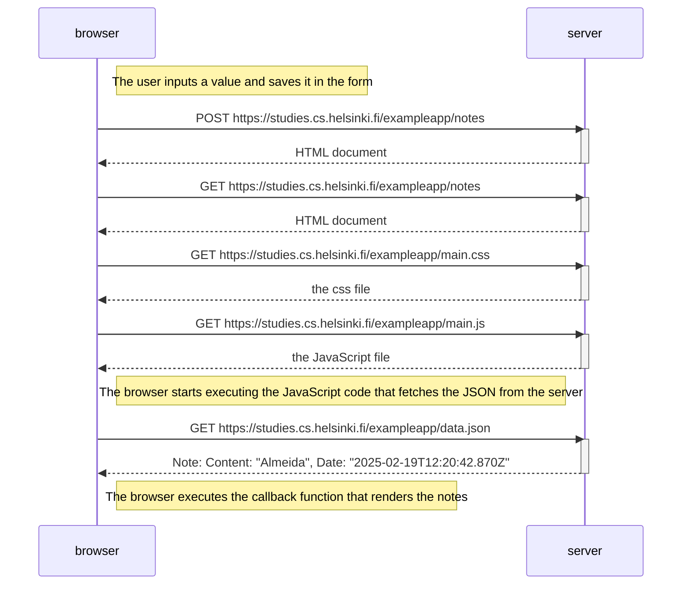

```mermaid
sequenceDiagram

participant browser
participant server

    Note right of browser: The user inputs a value and saves it in the form
browser ->> server: POST https://studies.cs.helsinki.fi/exampleapp/notes
activate server
server -->> browser : HTML document
deactivate server

browser ->> server: GET https://studies.cs.helsinki.fi/exampleapp/notes
activate server
server -->> browser : HTML document
deactivate server

    browser->>server: GET https://studies.cs.helsinki.fi/exampleapp/main.css
    activate server
    server-->>browser: the css file
    deactivate server

    browser->>server: GET https://studies.cs.helsinki.fi/exampleapp/main.js
    activate server
    server-->>browser: the JavaScript file
    deactivate server

    Note right of browser: The browser starts executing the JavaScript code that fetches the JSON from the server

    browser ->> server: GET https://studies.cs.helsinki.fi/exampleapp/data.json
    activate server
    server-->> browser: Note: Content: "Almeida", Date: "2025-02-19T12:20:42.870Z"
    deactivate server

        Note right of browser: The browser executes the callback function that renders the notes
```
