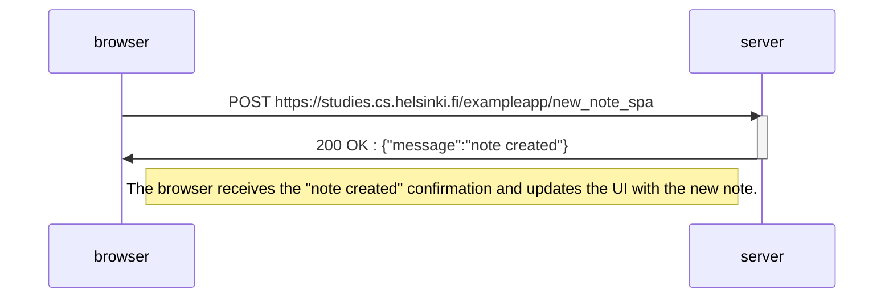

```mermaid
sequenceDiagram

participant browser
participant server

browser->> server:POST https://studies.cs.helsinki.fi/exampleapp/new_note_spa
activate server
server->> browser: 200 OK : {"message":"note created"}
deactivate server
Note right of browser: The browser receives the "note created" confirmation and updates the UI with the new note.
```