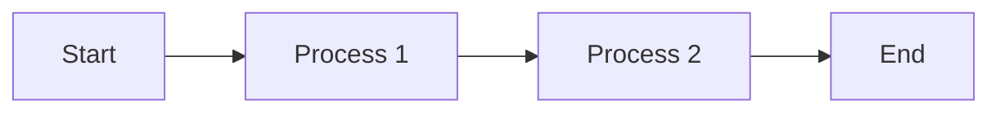
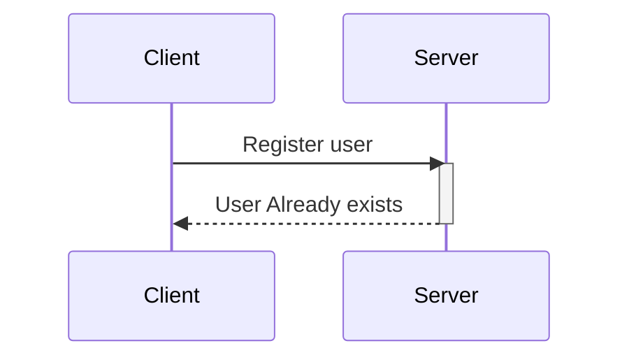
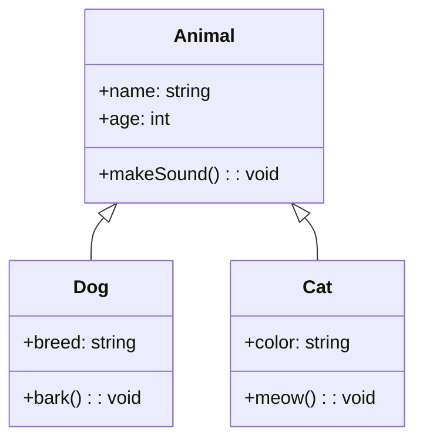
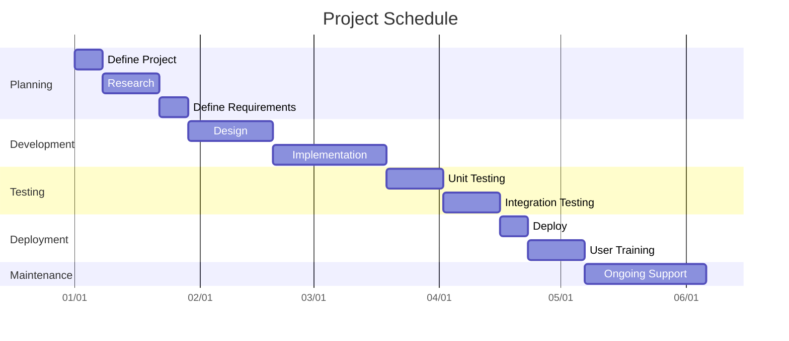
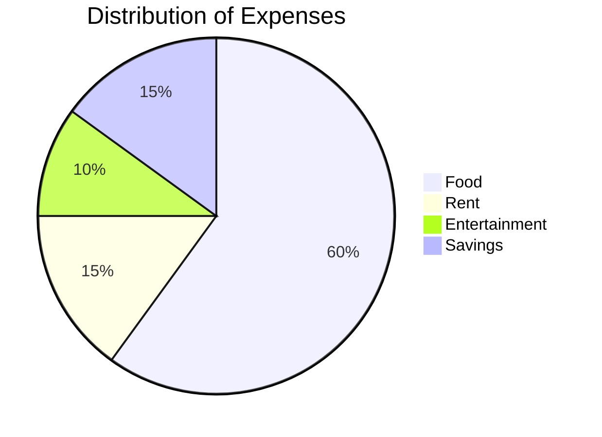

```mermaid
flowchart LR;
    A[Start] --> B[Process 1];
    B --> C[Process 2];
    C --> D[End]
```

```mermaid
sequenceDiagram
    participant Client
    participant Server
    Client->>Server:Register user
    activate Server
    Server-->>Client:User Already exists
     deactivate Server
```

```mermaid
classDiagram
    class Animal {
        +name: string
        +age: int
        +makeSound(): void
    }

    class Dog {
        +breed: string
        +bark(): void
    }

    class Cat {
        +color: string
        +meow(): void
    }

    Animal <|-- Dog
    Animal <|-- Cat

```

```mermaid
gantt
    title Project Schedule
    dateFormat YYYY-MM-DD
    axisFormat %m/%d

    section Planning
    Define Project : 2023-01-01, 7d
    Research : 2023-01-08, 14d
    Define Requirements : 2023-01-22, 7d

    section Development
    Design : 2023-01-29, 21d
    Implementation : 2023-02-19, 28d

    section Testing
    Unit Testing : 2023-03-19, 14d
    Integration Testing : 2023-04-02, 14d

    section Deployment
    Deploy : 2023-04-16, 7d
    User Training : 2023-04-23, 14d

    section Maintenance
    Ongoing Support : 2023-05-07, 30d

```

```mermaid
pie
    title Distribution of Expenses
    "Food" : 60
    "Rent" : 15
    "Entertainment" : 10
    "Savings" : 15

```